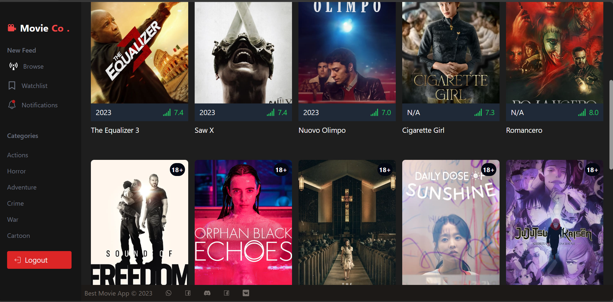

# React + TypeScript + Vite

# Movie House

The movie application allows users to browse and select films of their choice. They can watch the selected film and also rate it based on their experience. Additionally, users have the option to share the film with their friends or loved ones.

## Features:

- **Film Selection:** Users can browse through a vast collection of films and select the ones they are interested in. The application provides various search options, including genres, actors, directors, and keywords.

- **Seamless Streaming:** The application offers a seamless streaming service that allows users to watch their selected films without any interruptions or buffering issues. They can enjoy their favorite movies with ease.

- **Rating System:** After watching a movie, users can rate it based on their personal experience. They can assign a rating, such as stars or a numerical score, to reflect their overall satisfaction with the film. This helps other users in making informed decisions when selecting a movie.

- **Film Sharing:** Users have the ability to share their favorite films with their friends or loved ones. The application provides various sharing options, including social media platforms, email, or direct messaging. This allows users to recommend movies to others and initiate discussions about the films they enjoyed.

The movie application aims to provide users with a seamless and enjoyable movie-watching experience. It offers a wide range of films, easy navigation, ratings and reviews, and the ability to share films with others, making it a comprehensive platform for movie enthusiasts.

## Getting Started

This is the completed source code for:

To get started, follow these steps:

1. Clone this repository to your local machine. 
2. Run `npm install` to install the dependencies.
3. Run `npm run dev` to start the web server. 
